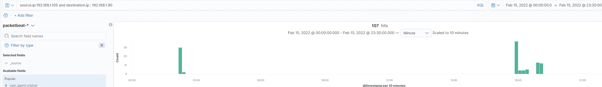

1. Identify the offensive traffic.
   - Identify the traffic between your machine and the web machine:
     - When did the interaction occur?

       `Local server time: 18:20`

     - What responses did the victim send back?
     
       `HTTP 401 `

        

     - What data is concerning from the Blue Team perspective?

       `High number of log in attempts from on IP ins a short amount of tme`

       

       

2. Find the request for the hidden directory.
   - In your attack, you found a secret folder. Let's look at that interaction between these two machines.
     - How many requests were made to this directory? At what time and from which IP address(es)?

       `Approximately 45,000 requests`

       `Local server time: 18:20`

       `192.168.1.90`

     - Which files were requested? What information did they contain?

       `//company_folders/secret_folder/connect_to_corp_server/`

       `Contained instructions to access corporate server`

     - What kind of alarm would you set to detect this behavior in the future?

       `Consecutive number of failed attempts above baseline in specified amount of time.`

     - Identify at least one way to harden the vulnerable machine that would mitigate this attack.

       `2FA for logins from unknown IPs (CAPTCHA / Authenticator app) `

       `Time delay after set amount of failed logins`

3. Identify the brute force attack.
   - After identifying the hidden directory, you used Hydra to brute-force the target server. Answer the following questions:
     - Can you identify packets specifically from Hydra?

       

     - How many requests were made in the brute-force attack?

        `Approximately 45,000 `

     - How many requests had the attacker made before discovering the correct password in this one?

        `Approximately 45,000 `

     - What kind of alarm would you set to detect this behavior in the future and at what threshold(s)?

        `Consecutive number of failed attempts above baseline in specified amount of time.`
     
     - Identify at least one way to harden the vulnerable machine that would mitigate this attack.

       `2FA for logins from unknown IPs (CAPTCHA / Authenticator app) `

       `Time delay after set amount of failed logins`

4. Find the WebDav connection.
   - Use your dashboard to answer the following questions:
     - How many requests were made to this directory? 

        `23`

     - Which file(s) were requested?

        `shell.php `

     - What kind of alarm would you set to detect such access in the future?

        `Alert on any new files added to the system remotely from unknown IPs`

     - Identify at least one way to harden the vulnerable machine that would mitigate this attack.

        `Restrict uploads to only safe files (No exacutable or scripting files)`

        `Local virus / malware scanner`

5. Identify the reverse shell and meterpreter traffic.
   - To finish off the attack, you uploaded a PHP reverse shell and started a meterpreter shell session. Answer the following questions:
     - Can you identify traffic from the meterpreter session?

        `Check for outbound connections to attacker machine`

        

     - What kinds of alarms would you set to detect this behavior in the future?

        `Report on any outbound connections to unknown IPs`

     - Identify at least one way to harden the vulnerable machine that would mitigate this attack.

        `Restrict outbound connections to unknown IPs through firewall`
